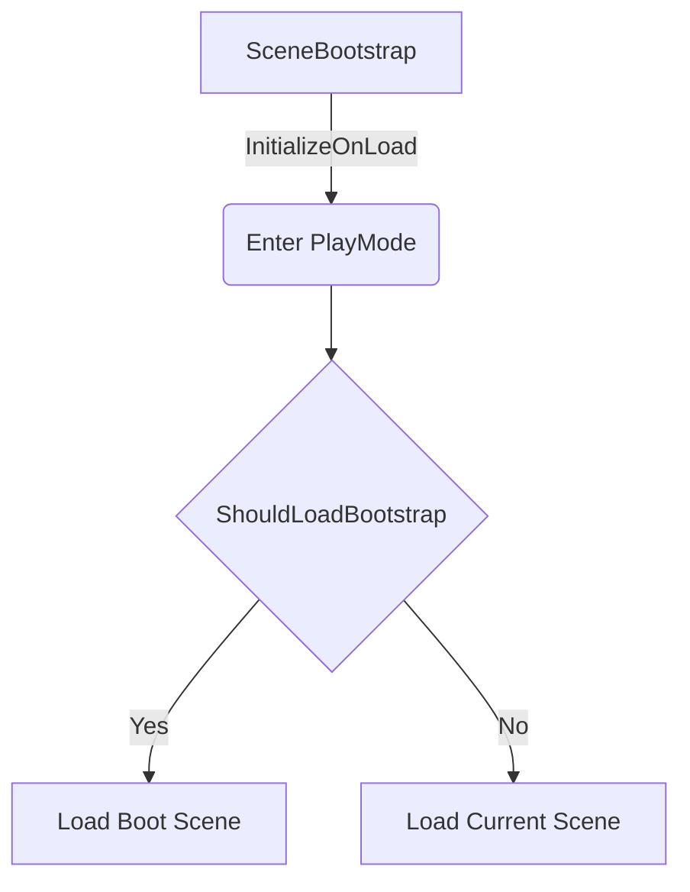

---
title: SceneBootstrapper 
author: lm
date: 2024-2-9
category: Editor
layout: post
mermaid : true
---  

使用场景
--------------  

#### PlayMode
使用 Unity Editor 时, 常见的 PlayMode, 可以化分为两种模式: PlayMode 和 EditorMode  
类似于状态机的状态, 每个状态的生命周期可以分为: Enter Update 和 Exit  
PlayMode 和 EditorMode 相关的生命周期的事件:   
1. EnteredPlayMode, 从 EditMode 进入 PlayMode, 但是在 Editor Application 的下一次 Update 之前发生. 相当于 Enter  
2. ExistingPlayMode, 退出 EditMode, 进入 PlayMode 之前
3. EnteredEditMode  
4. ExistingEdit Mode  

这两种模式的转换会由什么操作触发呢?  
很简单, 我们在 Unity Editor 中点击 Play 按钮进入 PlayMode  

#### 相关逻辑
Unity Editor 中点击 Play 按钮的逻辑是: 默认加载 Editor 当前打开的场景(在场景视图中).  
项目通常都是多场景的. 默认存在一个引导场景: Boot  
Boot 场景默认在游戏开始前第一个加载的场景, 因此 Boot 场景中会初始化一些全局对象, 例如 各种 Managers  

操作逻辑:  
1. 项目通常都是多场景的, 每个场景代表一个完整的模块. 开发的时候需要直接在单个场景中操作.
2. 点击运行按钮后, 可以根据需要从 Boot 场景开始运行, 也可以单独从当前场景开始运行.
3. 退出 PlayMode 后, 要还原为一开始打开的场景, 方便后续开发.

功能介绍
--------------  

#### 相关逻辑  
SceneBootstrapper 是一个静态类, 因为相当于编辑器扩展, 所以放置于 Editor 文件夹, 并且应用 InitializeOnLoad 特性, 这样只会在 Unity Editor 生效, 不会被打包进运行时.  

#### MenuItem  
我们需要通过 Editor 设置 ShouldLoadBootstrap 的值 , 在点击 Play 按钮后, 是否需要从 Boot 场景开始运行. 通过菜单栏选项来控制 ShouldLoadBootstrap 参数  

通过路径设置两个菜单栏选项: LoadBootstrap 和 DontLoadBootstrap 设置 ShouldLoadBootstrap 的参数  


// 菜单栏选项
[MenuItem("Quiz/Load Bootstrap Scene On Play")]
private static void EnableBootstrapper()
{
    ShouldLoadBootstrap = true;
}

// 控制菜单栏选项是否处于激活状态
[MenuItem("Quiz/Load Bootstrap Scene On Play", validate = true)]
private static bool ValidateEnabelBootstrapper()
{
    return !ShouldLoadBootstrap;
}
  

这个特性用法比较奇怪. 一个是作为菜单栏选项对应的操作方法, 添加了一个 validate 参数后, 直接变成了控制选项是否处于激活状态的函数.  
大概是因为, 这里的方法是通过反射根据特性来调用的, 所以不像普通的函数调用那么直观.  