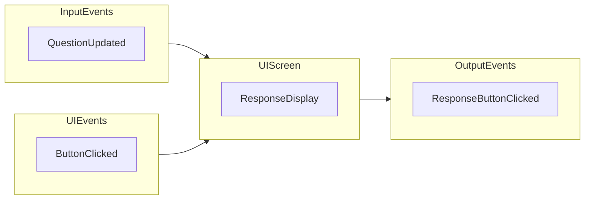

事件  
--------------
事件可以很方便的解耦依赖, 当某个操作或者时间节点会被不同的地方响应, 使用事件可以方便的解耦这些依赖关系  
事件的坏处就是, 原来依赖关系被转移到对于事件的依赖上, 增加了复杂度, 代码结构性降低, 阅读成本增加  

UIScreen类中的事件
---------------

### 订阅事件
UIScreen 类中, 订阅事件主要分为两种: 外部事件和内部事件  

外部事件, 来自其他模块的事件.  
例如 GameEvents.QuestionUpdated 事件, 所有依赖 QuestionData 的 UIScreen 都需要订阅该事件进行更新. 订阅外部事件的操作都集中在 SubscribeToEvents() 函数中, 并且这些外部事件与当前 UIScreen 实例的生命周期不一致, 所以, 一定需要在 UnSubscribeFromEvents() 函数中注销订阅, 防止不可预知的行为.  

内部事件, 来自当前 UIScreen 绑定的 UIDocument 中, 主要是 UIElements 的事件.  
例如 鼠标点击事件 button.RegisterCallback<ClickEvent>(ResponseCallback)  

### 触发事件
UIScreen 同样可以触发事件, 通常是某个 UI 操作, 需要调用业务逻辑处理. 那么触发一个事件, 通知业务模块.  
例如, 上面注册内部事件的回调函数 ResponseCallback. 玩家在界面中点击了答案按钮, 需要业务逻辑更新当前选中答案的状态, 然后再通过事件通知 UIScreen 更新界面元素  

可以看到, 事件机制的加入, 确实来来回回的增加了不少复杂度.  

订阅事件的代码规范
-----------------
就和创建对象实例一样, 有分配内存的操作, 就一定需要回收内存的操作, 例如 CSharp 中的 new 和 GC, C++ 中的 new/delete  
  
在 Unity Engine 中符合事件订阅的两个生命周期函数是: OnEnable() 和 OnDisable() 方法  
在 OnEnable() 方法中订阅事件, 这些事件全是当前对象接收的外部事件, 将外部的依赖关系解耦  
在 OnDisable() 方法中注销这些事件, 不然会有不可预知的行为以及内存泄漏  

那么没有与 Unity Engine 生命周期直接绑定的类怎么办?  
在构造函数中订阅所有外部事件, 并且提供一个 Disable() 函数, 注销所有订阅事件  
在 Unity Engine 中使用的类, 不直接绑定 Engine 的生命周期, 也会由绑定了 Engine 生命周期的类进行管理, 只需要管理类在它的 OnDisable() 方法中调用即可  

实例
-----------  
LevelSelectionPresenter 类本身没有绑定 Unity Engine 的生命周期, 但是由 GameController 进行管理  

由 GameController 类控制它的生命周期, 在接收外部事件创建 LevelPresenter, 在 OnDisable 方法中调用 LevelSelectionPresenter 类中的 Disable() 方法.   

整体流程如下:  
UIManager 管理所有 Screen 实例, 初始化时, 触发 LevelSelectionEvents.Initialized 事件, levelSelectionScreen 实例作为参数  
GameController 在 OnEnable 中订阅了 LevelSelectionEvents.Initialized 事件, 接收参数, 并且 new LevelSelectionPresenter(levelSelectionScreen)   
LevelSelectionPresenter类的构造函数中订阅了外部事件, 并且提供 Disable() 方法注销外部事件  
GameController 在OnDisable()方法中, 调用 levelSelectionPresenter.Disable()方法   

这样 LevelSelectionPresenter 类实现了在 Unity Engine 生命周期中合理的订阅/注销事件  
