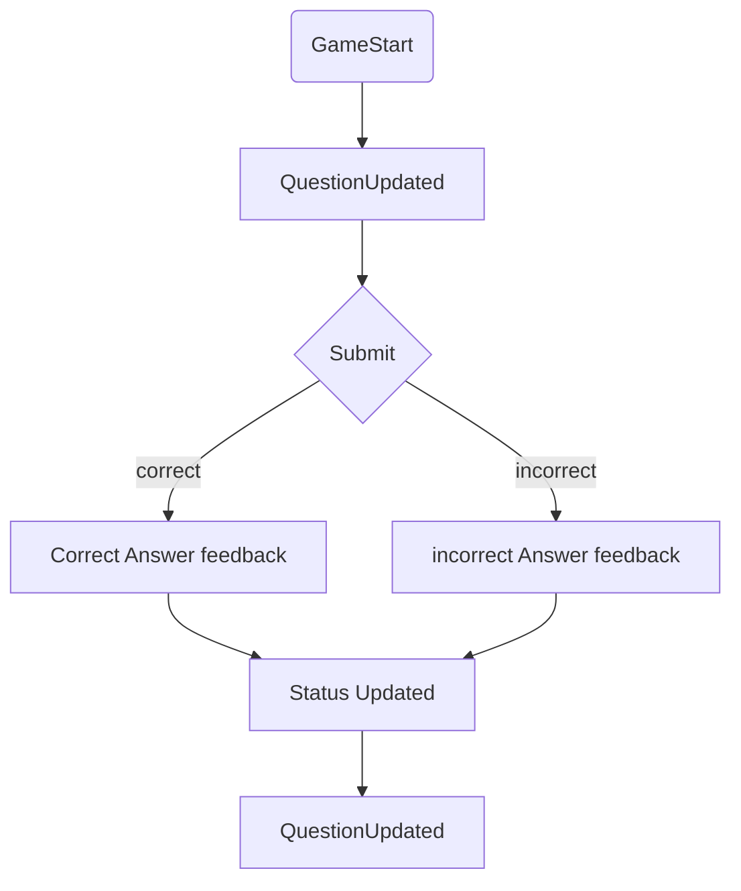
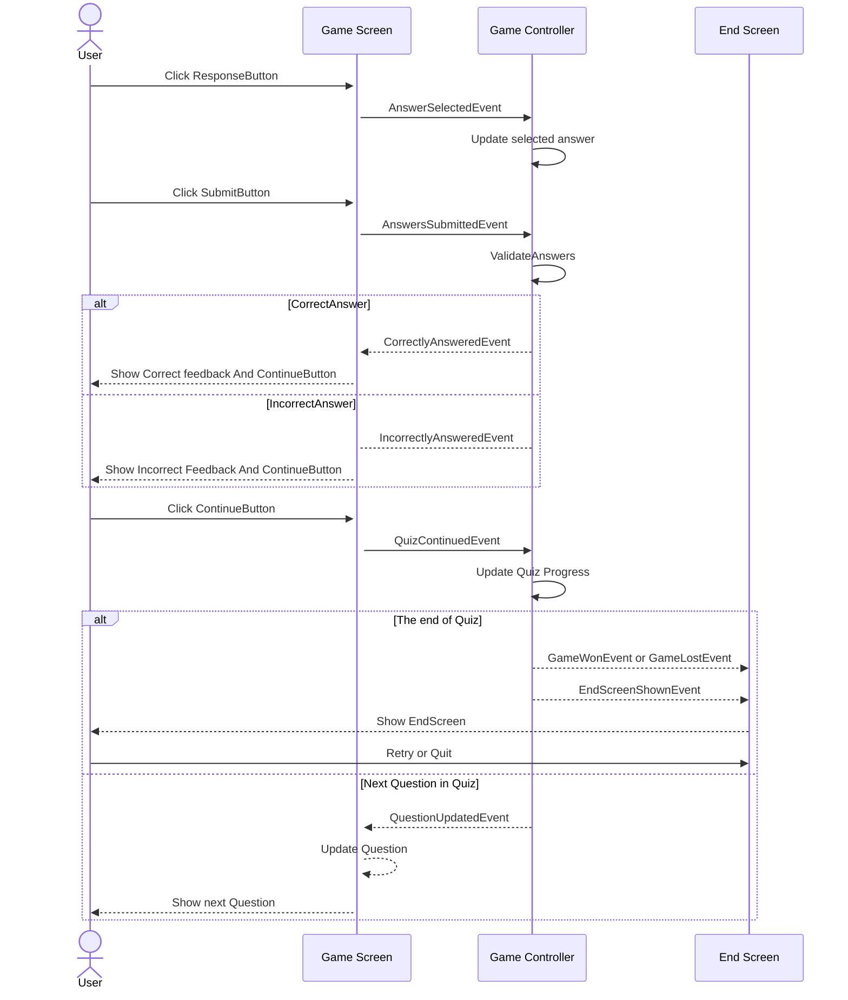

Gameplay 流程图  
--------------
 
1. 点击选项按钮答题
2. 提交答案
3. 反馈答题信息

Gameplay 事件流
---------------

GameController 中的 Gameplay 部分
-------------
GameController 控制整个 Gameplay 运行机制, 也是 Gameplay 与 Unity Engine 生命周期的结合点.  

GameScreen 中 UI 元素的所有操作涉及到的业务逻辑都在 GameController 中完成  

因此, GameController 同时作为 GameScreen 的 Presenter, 订阅页面操作事件, 并且触发业务事件.  
例如, GameController 订阅 Submit 事件, 调用业务处理函数, 更新状态后, 触发各个状态更新事件.  

业务逻辑中的状态
------------
从 gameplay 中抽象出来的状态有:  
+ 当前题目信息
+ 玩家选中的答案
+ 玩家提交的答案
+ 答题进度
+ 答题分数
+ 连胜数
+ 最大答题数
+ 生命数, 最多允许答错的数量

每一次答题后, GameController 都需要进行业务逻辑处理, 更新逻辑状态, 然后根据更新后的状态触发对应的事件.  

进行分析的时候, 先定义好状态的数据总是没错的, 之后再多的变化也是基于数据.  
因为 gameplay 的逻辑挺多的, 因此抽象出 Response 类存储答题业务的原始数据, 以及 ScoreMananger 基于 Response 类进行业务逻辑计算  

Response
------------
Response 类是一个纯数据类, 抽象出答题试卷的数据  
+ 试卷标题
+ 试卷题目总数
+ 最大允许错题数
+ 已经回答的问题数
+ 当前错误答题数
+ 当前正确答题数
+ 当前连胜数
+ 当前题目索引
+ 当前选择的答案

ScoreManager
---------------
ScoreManager 负责管理 gameplay 中, 分数计算机制  
ScoreManager 通过 Response 实例中的数据, 计算得出当前的状态, GameController 会在 Unity Engine 生命周期中调用 ScoreManager 更新 gameplay 的状态, 触发对应的事件, 驱动 gameplay 机制运行  

ScoreManager 是一个纯计算类, 根据 UserResponse 类的基础数据  

QuestionDisplay  
---------------
UI 界面显示链总是有一个起点, 这个起点称为 HomeScreen. HomeScreen 通常是主菜单, 也经常会在 UI 界面中看到返回主菜单的操作.  

返回主菜单本质上是重置 UI 显示逻辑链, 也就是清空 UI 界面栈, 将 HomeScreen 重置为显示起点, 等同于常见的 Reset.  
因此, 主菜单界面通常等同于 HomeScreen.  

