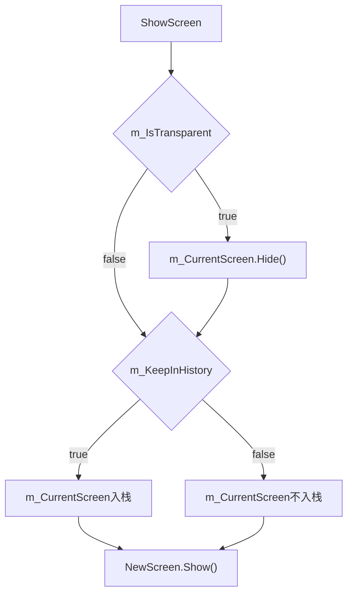

UI 界面显示栈  
--------------
UI 界面从表现形式上来说, 分为不透明和半透明的界面    

UI 界面栈, UI 界面的显示隐藏逻辑, 核心就是 当显示一个新界面时, 当前界面的需不需要入栈  
1. 入栈: 大部分UI界面都会入栈, 只要触发关闭界面后, 能够返回到上一个界面
2. 不入栈: 例如 启动画面 Start界面, 基本不存在回退到这两个画面的逻辑   

不透明或者半透明并不影响界面是否入栈, 只有这个窗口是否能够返回上一级界面才决定是否入栈.  

1. 当显示一个新的 UIScreen 实例 NewScreen 时, 首先判断是否半透明 m_IsTransparent. 半透明表示 m_CurrentScreen 不能隐藏
2. 再判断 NewScreen 是否需要有返回功能, 以此判断 m_CurrentScreen 是否需要入栈 
新的界面只需要显示即可, m_CurrentScreen 需要考虑就多了, 最终, NewScreen 也会变成 m_CurrentScreen.  

HomeScreen  
---------------
UI 界面显示链总是有一个起点, 这个起点称为 HomeScreen. HomeScreen 通常是主菜单, 也经常会在 UI 界面中看到返回主菜单的操作.  

返回主菜单本质上是重置 UI 显示逻辑链, 也就是清空 UI 界面栈, 将 HomeScreen 重置为显示起点, 等同于常见的 Reset.  
因此, 主菜单界面通常等同于 HomeScreen.  

