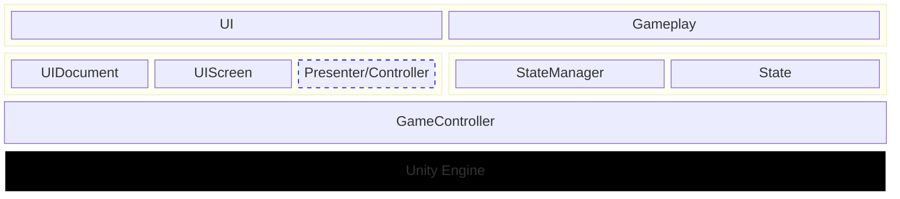

整体框架  
--------------

简单介绍
----------

### UI层
从顶层看来, UI 层接收用户输入, 并且输出反馈信息. Gameplay 是游戏机制的抽象, 本质上就是游戏运行时的状态数据.  
UI 层使用经典的 MVC/P 结构, View 层由 UIDocument 和 UIScreen 共同组成, Presenter/Controller 根据 View 层的复杂程度可选.  
Model 就是游戏状态, 由 Gameplay 提供.  

### GameController
Unity Engine 中使用的框架, 当然最重要的是要能与 Unity Engine 的生命周期绑. GameController 继承自 MonoBehaviour, 在其绑定的 Unity Engine 的生命周期函数中, 驱动 Gameplay  

UI 层进行业务逻辑调用, 会通过事件机制传递到 GameController 中, GameController 在 Unity Engine 的生命周期函数中进行事件处理操作, 调用 StateManager 更新 State, 也就是驱动 Gameplay  

### Gameplay 简单介绍  
Gameplay 通常会将相关的状态集中到一个 State 类中, 并且抽象一个 StateManager 集成对应的操作  
例如, 本项目中的 UserResponse 和 ScoreManager  

Gameplay 核心机制:  
1. 点击选项按钮答题
2. 提交答案
3. 反馈答题信息

