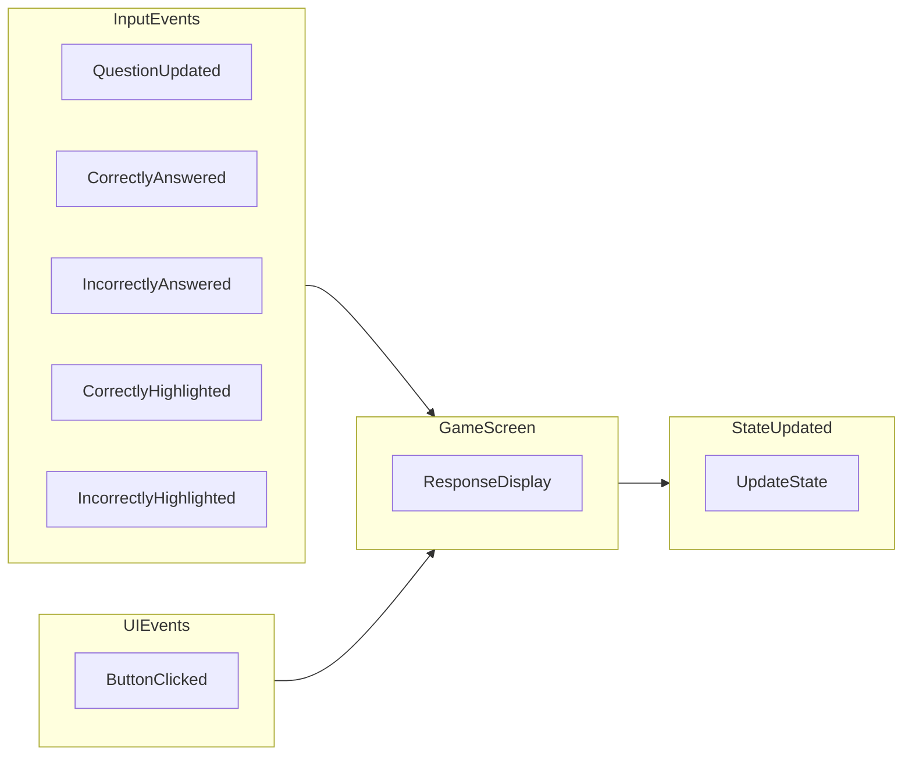

事件  
--------------

整体功能
----------------
GameScreen 是本项目的主要游戏界面, 因此它的功能就是游戏流程中的功能. ResponseDisplay 是GameScreen 中的一个子模块, 负责的功能是: 玩家答题.  

本项目, 玩家操作很简单, 就是点击选项按钮, 再点击提交.  
ResponseDisplay 只是玩家选择答案, 并没有提交, 因此业务逻辑很少, 所以并没有单独分出 Presenter.   

1. 玩家点击答案按钮
2. 判断当前题目是多选还是单选
3. 判断玩家是选中还是取消
4. 更新选中状态
5. 更新 UI 显示

外部事件  
---------------

### QuestionUpdated 事件
QuestionUpdated(questionData) 事件, 根据传入的 questionData 更新 UI 界面中的选项按钮和选择指令  

事件触发点:  
1. 关卡界面点击Play
2. GameScreen 提交答案后, 点击continue

问题更新后,  事件处理流程:  
1. 获取 questionData 中关于答案选项的数据
2. ShuffleAnswer(), 根据 questionData 的 m_ShuffleAnswer 标志, 来返回一个 Answer 集合, 赋值给成员 m_Answers
3. ResetPanel, 重置选项按钮
   1. ShowAnswers
      1. ClearSelection, 清除按钮上的选择效果
      2. ClearHighlight, 清除高亮按钮效果
      3. SetEnable
      4. 根据 m_Answers 设置对应的选项按钮

### CorrectlyAnswered/IncorrectlyAnswered 事件

