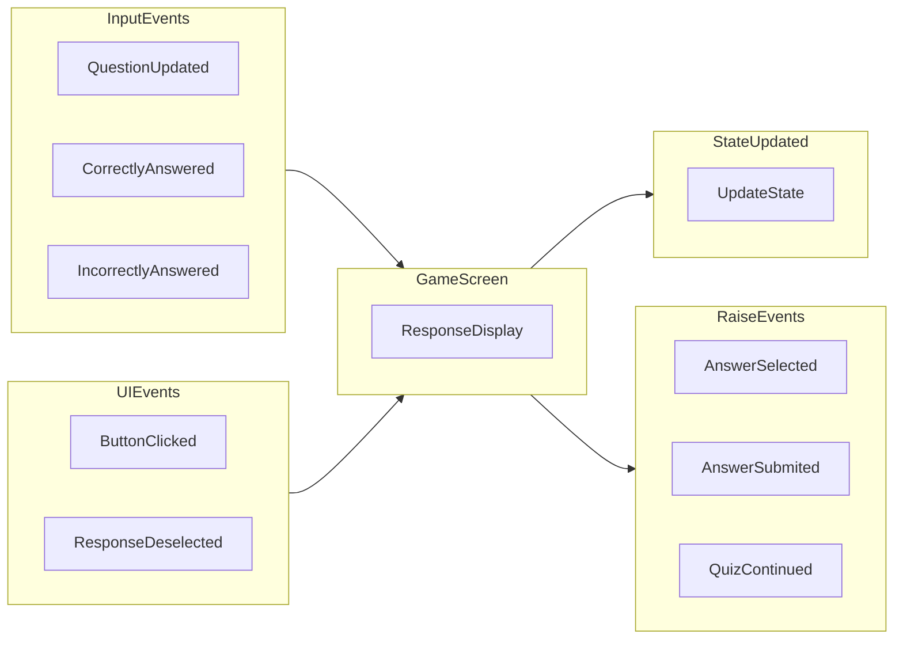

事件  
--------------

整体功能
----------------
MessageDisplay 是 GameScreen 中的一个子模块, 负责的功能是:  
1. 提交答案
2. 反馈提交的答案信息
3. 继续到下一个题目.  

外部事件  
---------------
### QuestionUpdated 事件
QuestionUpdated(questionData) 事件, QuestionUpdated 事件等同于初始化 MessageDisplay.  

事件触发点:  
1. 关卡界面点击Play
2. GameScreen 提交答案后, 点击continue

问题更新后,  事件处理流程:  
1. Reset()
   1. 重置面板, 实际上就是隐藏整个消息面板
   2. 隐藏并disable continue 按钮
   3. enable submit 按钮, 因为 submit 按钮本来就被 continue 覆盖, 所以不需要额外控制 submit 按钮的显示隐藏

### CorrectlyAnswered/IncorrectlyAnswered 事件
业务层对提交的答案进行判断来选择触发 CorrectlyAnswered/IncorrectlyAnswered 事件  

1. ShowResultText 展示反馈结果, 不同结果设置不同的样式
2. ShowFeedback 展示反馈消息, 不同结果设置不同的样式 

