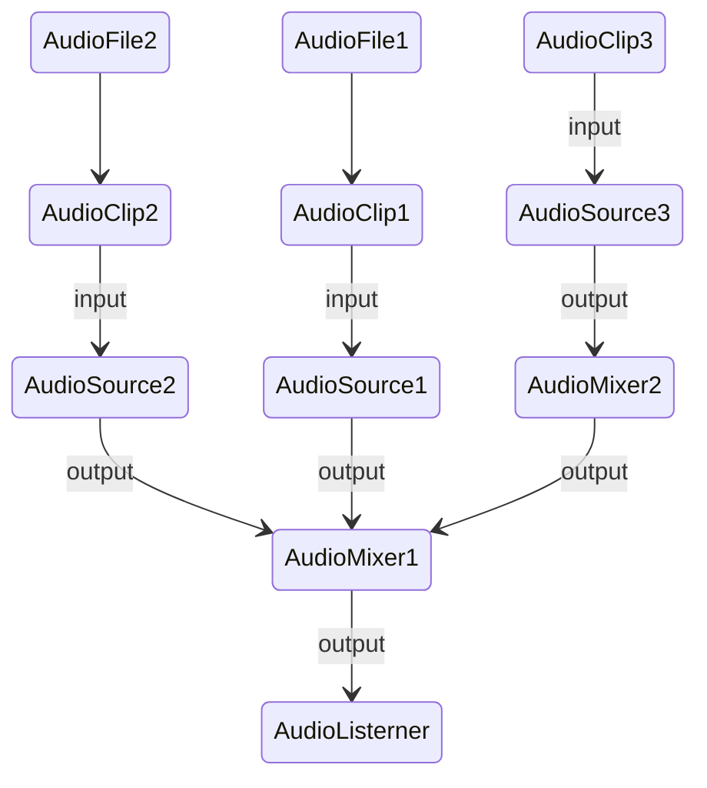
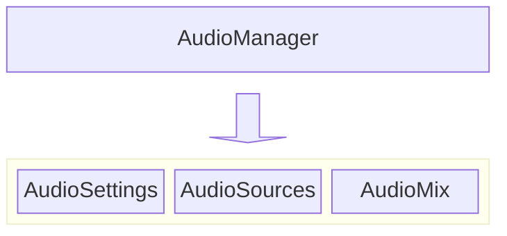

Unity 中的 Audio
-----------------
AudioClip 是音频文件导入 Unity Project 中的格式, 原始音频文件和游戏运行时使用的音频文件通常都是不同的, 因为原始音频文件通常是无压缩的最高清的格式, 而游戏运行时考虑性能或者容量的原因, 会根据音频不同使用不同的格式.  

AudioSource 音源的抽象, 除了包含 AudioClip 音频数据外, 还包含了声源的各种信息, 例如 位置信息, 是否循环播放等, 表示播放什么声音, 如何播放声音  

AudioMixer 是混合器, 顾名思义, 混合声音后输出声音信号, 如果不使用 AudioMixer, 播放声音的指令会直接提交给声卡, 同一时间提交过多的声音指令会像显卡卡帧一样产生爆音  
AudioiListener 这是一个特殊的对象, 具有唯一性, 因为声源可以有多个, 但是接收者始终只有一个, AudioListener 通常直接挂载在 MainCamera 上, 因为绝大多数的情况下, MainCamera 代表玩家的主观视角,   

AudioSource 首先输出到 AudioMixer 中, 可能会经过多个 AudioMixer, 最终混合才能到达 AudioListener 中  
AudioMixer 也可以输出到 AudioMixer 自身  

AudioManager  
--------------
AudioManager 的主要职责是: 加载音频文件, 音频播放管理  

1. 加载 AudioSettings   
2. 提供播放声音的接口  
  

> ##### TIP
>
> Manager 和 Controller 的差别, 实际上和字面意思差不多, Manager 侧重于调度, Controller 侧重于驱动  
> 例如 UIManager 负责初始化 View(UI Document  UIScreen) 以及 Presenter/Controller(UIPresent) 实例, 并且负责将它们组装起来  
> GameController 中负责 GamePlay 的运转, 接收外部的 GameEvents, 进行对应的逻辑处理后, 触发对应的 GameEvents  
{: .block-tip }

Audio 机制
------------

1. AudioFile, 是外部资源文件, 常见格式 .mp3 .wav 等  
2. AudioClip, Unity对于外部资源文件都会统一导入为Unity中能够使用的格式, 例如 AudioClip, AudioClip 中存储了导入 AudioFile 的各种导入设置, 实际上就是外部文件转换成Unity 统一格式的设置, 在 Unity 中视为音频资源  
3. AudioSource, Unity 中对于声源的抽象数据结构, 包含最基本的音频资源, 声源的输出对象等声源的各种数据  
4. AudioMixer, 音频混合器, 现实世界中会有很多声源, 声源发出的声音会互相混合, AudioSource 设置 output 为AudioMixer, AudioMixer混合声源输出到 AudioListerner 或者另一个 AudioMixer 中  
5. AudioListerner, 代表声音的接收者, 有且只有一个, 通常主观视角都是MainCamera, 因此通常挂载在 MainCamera 上  

AudioMixer  
---------------
AudioMixer 和 AudioClip AudioSource 一样, 都是以 Asset 的形式存在于项目中.  
想要在游戏运行时使用 AudioMixer 这种 Asset 类型, 有两种方法:  
1. 挂载在某个 GameObject 上, 随着 GO 的初始化一起初始化, 注意这种方式对于 Asset 都是引用 
2. 代码中初始化, 注意, 代码初始化可能创建的就是拷贝的副本

AudioMananger
---------------
一个最简单的音频播放需要:  
1. 音频文件: AudioClip  
2. 声源: 声音产生的信息  
3. 混合器: 场景中不同声音的混合

Manager 作为总体的管理者, 基本可以从 what when how 这三个方面来分析  
What, AudioManager 需要管理音频和声源, 本项目只有简单的使用场景  
When, AudioManager 需要提供对外的音频播放机制, 让外部随时调用  
How, AudioManager 需要提供各种音频播放机制, 例如 3D 场景中的地点播放, 声音播放之间的淡入淡出  

> ##### TIP
>
> 本项目中, AudioSources 只需要确定的三个, BGM SoundEffect Music, 通常在复杂的声音使用场景中, 会同时播放多个 SoundEffect, 因此会动态生成 AudioSource, 需要使用对象池技术管理  
> 本项目中, AudioClip 都集中在 AudioSettingsSO 中, 加载 AudioSettings 等于加载了 AudioClip  
> 和 Unity Engine 结合之后, 加载 Asset 有两种方法, 代码和Editor中拖拽, 很容易令人困惑
{: .block-tip }
  

#### AudioManager的定位
AudioManager 与其他 Manager 一样, 会聚合很多小模块的业务逻辑, AudioManager 与 GameController 有明显的不同, GameController 可以认为是业务层, 内部逻辑都是业务逻辑处理   

AudioMananger 并不属于 UI 层的 MVP 或者业务逻辑层其中之一, AudioManager 类似于基于横切关注点的系统, 就像日志系统一样. 这种系统可以在任意地方进行调用, 因此, AudioManager 不会与具体的 UI 逻辑或者业务逻辑耦合.  
例如, UI 层点击按钮发出声音, 可以直接调用 AudioManager 中的播放声音的 API  

Manager 通常是一个高内聚的模块, 内部具有完整的逻辑, 例如本项目中另一个 Manager: UI Manager, UI Manager 本身的职责是维护 UI 界面的显示栈, 它不需要考虑接收业务逻辑还是UI逻辑, 它只需要定义好自己的 API 和事件, 让外部订阅即可   

所以 AudioManager 的 API 设计应该简洁而且内聚, 能够聚合到一起的逻辑都应该聚合成一个 API  
例如, 在业务逻辑中,播放关卡胜利的声音和播放关卡失败的声音, 实际上都调用 AudioManager 中的同一个 API   

#### GameplaySound
GameplaySound 类用来解耦对于 AudioManager 类中播放声音的调用.   
例如, UIEvents.ButtonClicked => GameplaySound.PlayButtonClick => m_AudioManager.PlaySFXAudio  
GameplaySound 加上事件机制 将 AudioManager 的耦合关系单独聚合起来, 保证业务逻辑和 AudioManager 的内聚性  

最大音量
----------------
Unity AudioMixer 中可以看到音量的上下限在 -80db 到 20db   

音量单位 db 的计算公式是对数计算, 转换成线性需要额外的数学计算  
-80 db 到 0 db 转换为线性 0 到 1  

本项目的转换公式中, 线性值[0.0001, 1] 对数运算后 [-4, 0], 乘以系数20, 得到最终结果 [-80, 0]  

0 db 实际上就是最大音量?   
这也符合所有的  

链接 
------------
https://blog.csdn.net/tqy19921202/article/details/103734295  

[AudioManager](https://blog.csdn.net/lrh3025/article/details/103540345)

